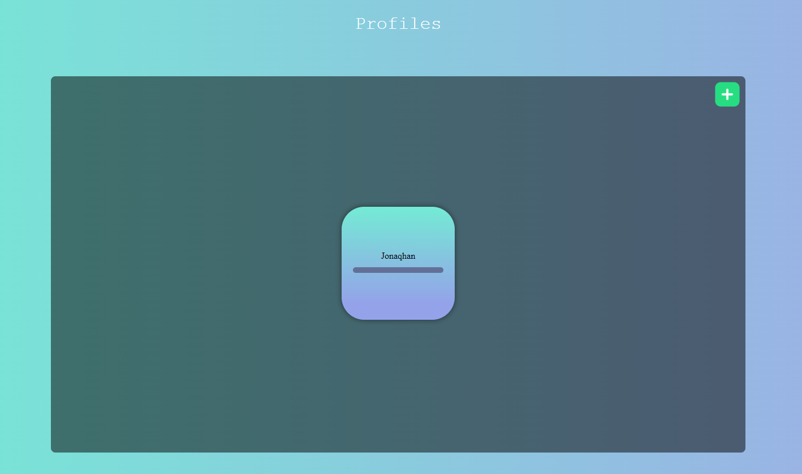

# Flash Cards Application
## Made with Electron and Express


<br><br><br><br><br><br><br><br>
  
# Installation

To use the desktop application you need to download and execute:
```sh
setup.exe 
```

It's also possible to use the application in the browser:
```sh
http://localhost:54789/
```

Data is stored in the ```resources folder``` inside the application with new setup.exe's you need manually copy/paste your data

# Images
<div style="display: flex; gap: 40px; flex-direction: column; align-items: center;">
    
    
    
      
</div>